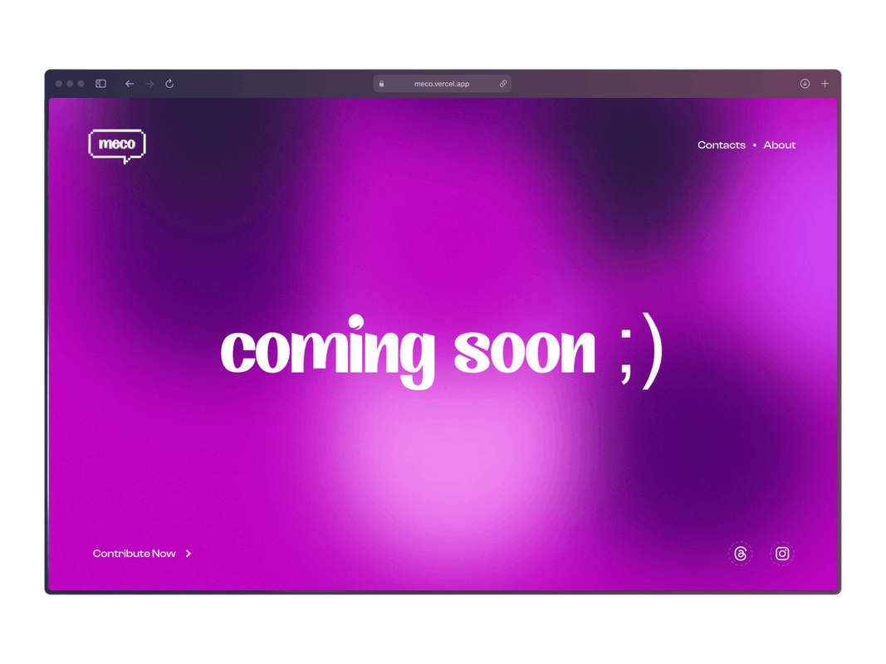

# meco

This repository currently hosts a 'Coming Soon' webpage, providing a sneak peek into meco — an initiative dedicated to promoting mental well-being. The full-fledged web application is actively under development in a separate repository. Originating from the GenAi Workshop, meco is transforming into a comprehensive platform. While this repository marks the initial stage, the primary platform is progressing independently, aspiring to establish a secure and inclusive space for everyone.

## Sneak Peek

## The Problem

Many individuals facing emotional distress encounter barriers to
accessing adequate mental health support. Stigma surrounding
mental health issues, limited resources, and a _**lack of convenient
and confidential communication channels**_ contribute to the
challenges people experience in seeking understanding and
assistance. This gap leaves a significant portion of the
population without a direct outlet to express their thoughts and
emotions, hindering their ability to cope with and address mental
health issues effectively.

## The Solution

_**meco**_ steps in to solve the problem oflimited mental health
support. It provides a direct and stigma-free space for you to
share yourfeelings. With meco, you can connect with supportive
listeners easily. It's a simple and effective solution, creating a
community that cares about your mental well-being. Also
providing professional help if needed.

## Built With

## Made by

1. [Abhay Balakrishnan](https://github.com/ABHAY-100/)
2. [Aadithya Madhav](https://github.com/aadithyayy)

 
Thank you for your interest in meco! 🤝
